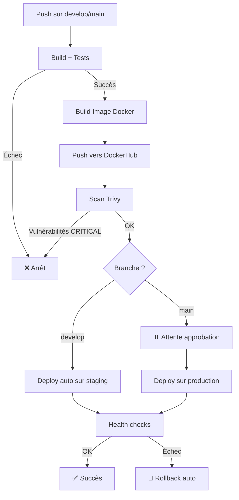

# Continuous Deployment - Sécurité et Bonnes Pratiques

## ⚠️ Risques du déploiement automatique

### Est-il vraiment sûr de déployer automatiquement chaque nouvelle image sur le hub ?

**NON, ce n'est pas sûr sans mesures de protection !** Voici les risques principaux :

1. **Bugs en production** 
   - Une image contenant du code non testé ou bugué peut être déployée immédiatement
   - Impact direct sur les utilisateurs finaux
   - Downtime potentiel

2. **Vulnérabilités de sécurité**
   - Dépendances vulnérables (CVE) peuvent être déployées
   - Code malveillant si le pipeline est compromis
   - Exposition de données sensibles

3. **Manque de contrôle**
   - Pas de validation humaine avant mise en production
   - Difficile de rollback rapidement
   - Pas de fenêtre de maintenance planifiée

4. **Problèmes de compatibilité**
   - Breaking changes non testés en conditions réelles
   - Incompatibilité avec infrastructure existante
   - Migrations de base de données non validées

## 🛡️ Mesures de sécurité implémentées

### 1. Tests automatiques (Job `build-and-test`)
```yaml
- name: Run tests
  run: |
    cd docker-backend-api
    mvn test
```
**Protection** : Vérifie que le code fonctionne avant de construire l'image.

### 2. Scan de vulnérabilités avec Trivy (Job `security-scan`)
```yaml
- name: Run Trivy vulnerability scanner
  uses: aquasecurity/trivy-action@master
  with:
    severity: 'CRITICAL,HIGH'
```
**Protection** : Détecte les CVE dans les dépendances et l'image Docker.

### 3. Environnements protégés GitHub
```yaml
environment:
  name: ${{ github.ref == 'refs/heads/main' && 'production' || 'development' }}
```
**Protection** : 
- `development` (branche develop) → déploiement automatique
- `production` (branche main) → **nécessite approbation manuelle**

### 4. Health checks post-déploiement
```yaml
- name: Health check
  run: |
    curl -f http://${{ secrets.DEPLOY_HOST }}/api/ || exit 1
    curl -f http://${{ secrets.DEPLOY_HOST }}/api/students || exit 1
```
**Protection** : Valide que l'application répond correctement après déploiement.

### 5. Tags d'images versionnés
```yaml
tags: |
  ${{ secrets.DOCKERHUB_REPO }}:latest
  ${{ secrets.DOCKERHUB_REPO }}:${{ github.sha }}
```
**Protection** : Permet de rollback vers une version précise si problème.

### 6. Secrets sécurisés
- Toutes les credentials sont dans GitHub Secrets (jamais dans le code)
- Clés SSH nettoyées après usage
- Vault Ansible pour données sensibles

## 📋 Recommandations additionnelles pour renforcer la sécurité

### A. Stratégie de branches Git
```
main (production)     → Déploiement manuel avec approbation
  ↑
develop (staging)     → Déploiement auto sur environnement de test
  ↑
feature/* (dev)       → Build + tests uniquement (pas de deploy)
```

### B. Ajouter des tests d'intégration
```yaml
- name: Integration tests
  run: |
    docker-compose up -d
    sleep 10
    curl -f http://localhost/api/students
    docker-compose down
```

### C. Blue-Green Deployment
Déployer sur un serveur secondaire, puis basculer le trafic si OK :
```yaml
- name: Deploy to blue environment
  run: ansible-playbook deploy-blue.yml
- name: Run smoke tests
  run: ./smoke-tests.sh blue
- name: Switch traffic to blue
  run: ansible-playbook switch-traffic.yml
```

### D. Monitoring et alertes
- Intégrer Datadog / Prometheus / New Relic
- Alertes Slack/Email en cas d'échec de déploiement
- Dashboard de métriques temps réel

### E. Rollback automatique
```yaml
- name: Rollback on failure
  if: failure()
  run: |
    ansible-playbook rollback.yml
```

### F. Limites de débit (rate limiting)
- Empêcher plus de X déploiements par jour
- Fenêtres de déploiement autorisées (ex: 10h-18h en semaine)

### G. Code signing et image signing
```yaml
- name: Sign image with Cosign
  uses: sigstore/cosign-installer@main
- run: |
    cosign sign ${{ secrets.DOCKERHUB_REPO }}:${{ github.sha }}
```

## 🚀 Configuration requise sur GitHub

### Secrets à définir (Settings → Secrets & variables → Actions)
- `DOCKERHUB_USERNAME` : Nom d'utilisateur DockerHub
- `DOCKERHUB_PASSWORD` : Token d'accès DockerHub (PAT)
- `DOCKERHUB_REPO` : Nom du repo (ex: `cramviz/my-backend`)
- `SSH_PRIVATE_KEY` : Clé privée SSH pour connexion au serveur
- `DEPLOY_HOST` : Hostname du serveur (ex: `vicram.selva.takima.cloud`)
- `ANSIBLE_VAULT_PASSWORD` : Mot de passe du vault Ansible

### Environnements à créer (Settings → Environments)
1. **development**
   - Protection rules : aucune (déploiement auto)
   - Secrets spécifiques au dev si nécessaire

2. **production**
   - Protection rules : **Required reviewers** (1-2 personnes)
   - Deployment branches : `main` uniquement
   - Wait timer optionnel (ex: 5 min avant déploiement)

## 📊 Workflow de déploiement sécurisé



## 🎯 Conclusion

Le déploiement automatique **n'est sûr que si** :
- ✅ Tests automatisés couvrent le code
- ✅ Scan de sécurité actif (Trivy, Snyk, etc.)
- ✅ Environnements séparés (dev/staging/prod)
- ✅ Approbation manuelle pour production
- ✅ Monitoring et rollback en place
- ✅ Secrets bien gérés (GitHub Secrets, Vault)

Sans ces protections, le déploiement auto est **dangereux** et peut causer des incidents de production graves.
